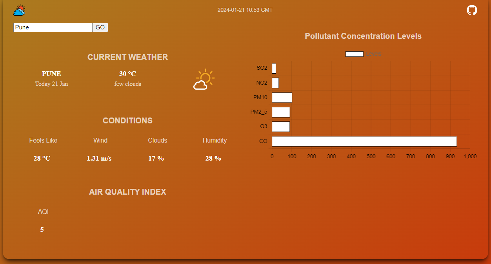

# Design Weather App 

## **OVERVIEW**

> Design a weather app that fetches data from OpenWeatherAPI and displays weather and air quality.
<p>
    
</p>

<br/>
<br/>

> Backend is implemented as Django framework.
> Frontend app is developed using React.js, material-UI and chart.js


## Pre Requisites

- `Node.js` and `npm` 
- `Django` 
- OpenWeather API key (This app uses mine)

<br/>

## Running The App

- Clone the repository:

```bash
git clone https://github.com/praypratyay/OpenWeather.git

```

- Running Django Backend
```bash 
pip install -r requirements.txt
python3 Weather/manage.py makemigrations weather_app
python3 Weather/manage.py migrate weather_app
python3 Weather/manage.py runserver
```
The backend will now be running at port 8000.
You can check by going to http://127.0.0.1:8000/api/London/

- Running React Frontend
```bash 
cd Weather-ui
npm install 
npm start
```
The frotend will now be running at port 3000.
You can check by going to http://localhost:3000/

<br/>

## Demo
